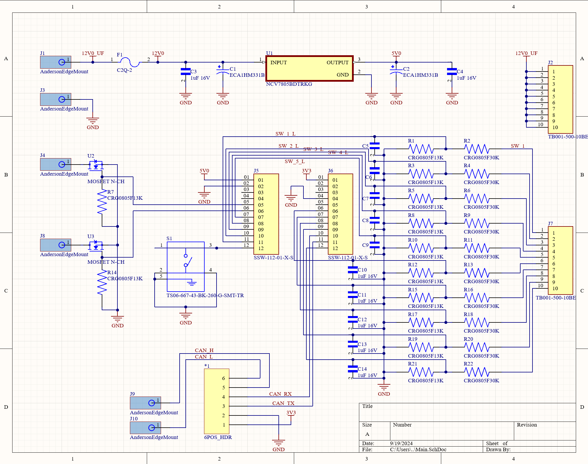

# DecentralizedLV-Sense
Software Repository for Sense Board which specializes in reading switches from the driver.


## Project Overview

The DecentralizedLV Sense board has the primary role of receiving button inputs from the driver and controlling one of the two instrument clusters. Originally, it controlled a [Volkswagen Golf GTI instrument cluster](https://github.com/matthewpanizza/CANAnalyzer#chapter-1-mk4-vw-golf-gti-instrument-cluster), but we later converted it to use a [2018 Camry instrument cluster](https://github.com/matthewpanizza/CANAnalyzer#chapter-2-2018-camry-instrument-cluster). This board is succeeded by the [DecentralizedLV-DashController](https://github.com/matthewpanizza/DecentralizedLV-DashController) which implements the more modern [Boards API](https://github.com/matthewpanizza/DecentralizedLV-Boards). See the main [DecentralizedLV-Documentation repository](https://github.com/matthewpanizza/DecentralizedLV-Documentation) for information about the DecentralizedLV system and how to set up the software environment for programming this board.


## Block Diagram


## Hardware Capabilities
- 2X [Low-power driver pins](https://github.com/matthewpanizza/DecentralizedLV-Documentation?tab=readme-ov-file#low-power-output-pins-supply-power-to-low-power-devices-less-than-5-amps) (WKP, DAC) (N-MOSFET Configuration). WKP supports PWM.
- 5X [Sense Pins](#https://github.com/matthewpanizza/DecentralizedLV-Documentation?tab=readme-ov-file#sense-pins-read-binary-onoff-switches-or-12v-signals) (3.3:1 voltage divider ratio)
- 5X [Analog Sense Pins](https://github.com/matthewpanizza/DecentralizedLV-Documentation?tab=readme-ov-file#analog-sense-pins-read-voltage-level-of-a-signal) (3.3:1 voltage divider ratio), pins A1-A5
- 10X 12V passthrough header to connect to switches for feeding to [Sense Pins](#https://github.com/matthewpanizza/DecentralizedLV-Documentation?tab=readme-ov-file#sense-pins-read-binary-onoff-switches-or-12v-signals)
- Multipurpose button which can be read on A0

## Important Roles
- Reads in switches from the vehicle's driver, encodes that information in a CAN Bus packet, and transmits it out to other boards in the DecentralizedLV System
- Determines if the car is in an Accessory or Ignition power state by reading the Ignition busbar voltage
- Commands the [LPDRV](https://github.com/matthewpanizza/DecentralizedLV-Documentation?tab=readme-ov-file#low-power-output-pins-supply-power-to-low-power-devices-less-than-5-amps) boards about the state of the headlights, turn signals, brakes, pumps, fans, etc based on the dashboard's switches.
- Commands the [Camry Instrument Cluster](https://github.com/matthewpanizza/CANAnalyzer#chapter-2-2018-camry-instrument-cluster) or [GTI instrument cluster](https://github.com/matthewpanizza/CANAnalyzer#chapter-1-mk4-vw-golf-gti-instrument-cluster) and changes its indicators based on data from other parts in the system (fuel level, BMS/Motor errors, headlights, speed)
- Displays a battery management system fault to the vehicle's driver
- Receives motor and battery temperature from the Systems Architecture Computer over CAN Bus
- Enables/disables some cooling pumps/fans when the motor/battery temperature is below some threshold
- [GTI Only] Spoofs CAN Bus messages to control a Mazda power steering pump


### CAN Bus Communication

CAN Bus communication is handled using the integrated CAN Bus controller in the Photon. This board does not use the [DecentralizedLV-Boards API](https://github.com/matthewpanizza/DecentralizedLV-Boards) since it has been succeeded by the [DecentralizedLV-DashController](https://github.com/matthewpanizza/DecentralizedLV-DashController). This board transmits on CAN bus address 0x100. See the [DecentralizedLV-Documentation CAN Bus Section](https://github.com/matthewpanizza/DecentralizedLV-Documentation?tab=readme-ov-file#can-bus-fundamental-concepts) for more information on data transmission using CAN Bus.


### Camry Instrument Cluster Control
This board has the important role of collecting information from the rest of the DecentralizedLV system and passing information that needs to be displayed to the driver via the Camry Instrument Cluster. The instrument cluster has a series of CAN Bus messages is responds to which are present in the `loop()` function in this program. The spoof has since been abstracted using the [Boards API](https://github.com/matthewpanizza/DecentralizedLV-Boards) which makes it much more easy to read.


### Mazda Power Steering Pump Control

Since we no-longer had an engine in the Volkswagen GTI, we installed a 12V-powered power steering pump which pressurized the fluid in the stock steering rack. This pump was salvaged from a Mazda we found in a pick-your-part junkyard. To operate the pump, we needed to supply it with 12V and then send it a CAN Bus message to tell it to start spinning.The CAN Message for the pump had the following data structure:

```
address: 0x201

byte 0: 0x49
byte 1: 0x04
byte 2: 0x20
byte 3: 0x20
byte 4: 0x02
byte 5: 0x02
byte 6: 0x05
byte 7: 0x0E
```

### PCB Schematic / Boardview



